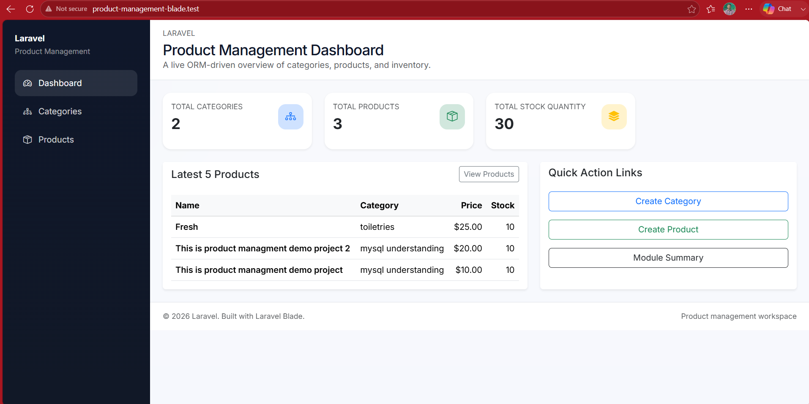

# Product Management

A Laravel-based product management app with category and product workflows, an admin-style dashboard, and a clean Blade UI.

## Features

- **Dashboard**
  - ORM-driven overview showing total categories, total products, total stock quantity, and latest 5 products.

- **Category Management**
  - Create, list, view, edit, and delete categories.
  - Each category can display its assigned products.

- **Product Management**
  - Create, list, view, edit, and delete products.
  - Product creation includes validation, success messages, and confirmation pages.

- **Query Builder Product Listing**
  - Search products by name.
  - Sort products by price.
  - Display total product count.

- **Blade UI**
  - Master layout with header, navbar, and footer partials.
  - Reusable form partials and clean admin-style pages.

## Video Demo

[Watch the YouTube demo](https://www.youtube.com/watch?v=IpLoDv09Vlg)

## Screenshot

## Stack Used

- Laravel
- PHP
- MySQL
- Blade
- Bootstrap 5
- Laravel Eloquent ORM
- Laravel Query Builder

## How to Install

1. Clone the repository.
2. Run `composer install`.
3. Copy `.env.example` to `.env` and update your database settings.
4. Run `php artisan key:generate`.
5. Run `php artisan migrate`.
6. Run `npm install`.
7. Run `npm run build` or `npm run dev`.
8. Start the app with `php artisan serve`.
